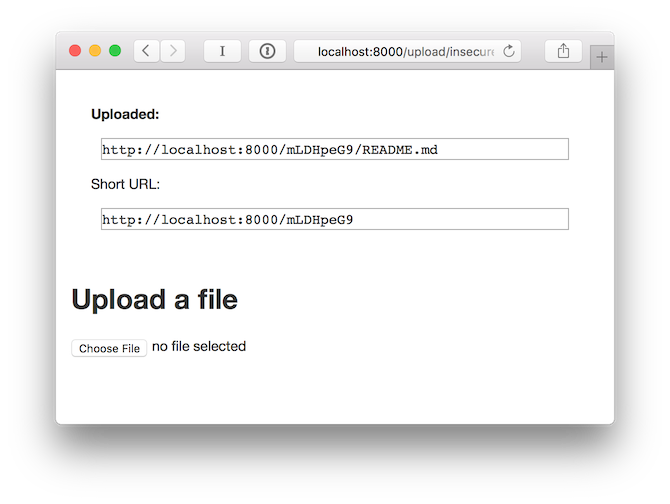

# DropLink

A simple private file sharing site, similar to file hosters.

Upload a single file on an upload page (authenticate via a private URL) and get a download URL that's hard to guess. Data is stored on the filesystem.

If you want, uploaded files are cleaned up after a specified amount of time.

DropLink generates URLs like this:

    https://example.com/dl/5Riewe4y/README.md

The URLs also work as short-URLs without the last filename part:

    https://example.com/dl/5Riewe4y

## Installation

Compilation requires [Go](https://golang.org).

    go get https://frister.net/go/droplink

## Running

DropLink is configurable via environment variables. When running on the public internet, you should at least specify an `ADDRESS` and an `UPLOAD_SECRET` and use a reverse proxy with TLS in front of DropLink.

Available environment variables:

* `ADDRESS` - Address to listen on. Default: `localhost:8000`
* `DATA_DIR` - Where to store the uploaded files. Default: `./data`
* `PATH_PREFIX` - URL path prefix to strip before handling the request. Required when running in a subpath behind a reverse proxy. Example: `/downloads`, default: (empty)
* `URL_PREFIX` - Absolute URI that's used as prefix for generated URLs, with trailing slash (`/`). Example: `https://example.com/downloads/`, default: `http://localhost:8000`
* `UPLOAD_SECRET` - Secret required for uploading files, you'll later have to put it into the URL, so might not want to use any fancy characters. Example: `2db19923c912b3ebbc373067`
    *  OpenSSL can generate such a secret for you: `openssl rand 12 -hex`
* `CLEANUP_AFTER_HOURS` - Delete files after the specified number of hours. Also requires `CLEANUP_EVERY_MINUTES` to be set. Example: `720` for 30 days (`24 * 30`), default: (no deletion)
* `CLEANUP_EVERY_MINUTES` - Check for files to delete every X minutes. Also requires `CLEANUP_AFTER_HOURS` to be set.

With the environment variables set, you can run droplink:

    droplink

DropLink logs to STDERR.

# License

[AGPLv3](LICENSE)
